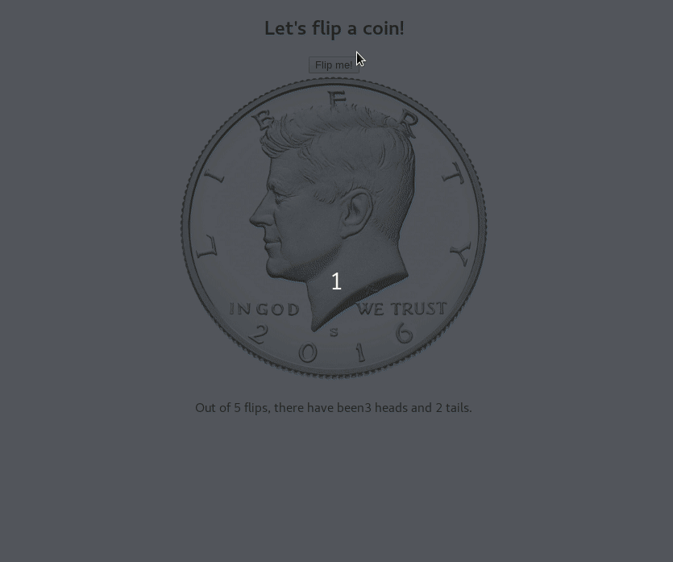
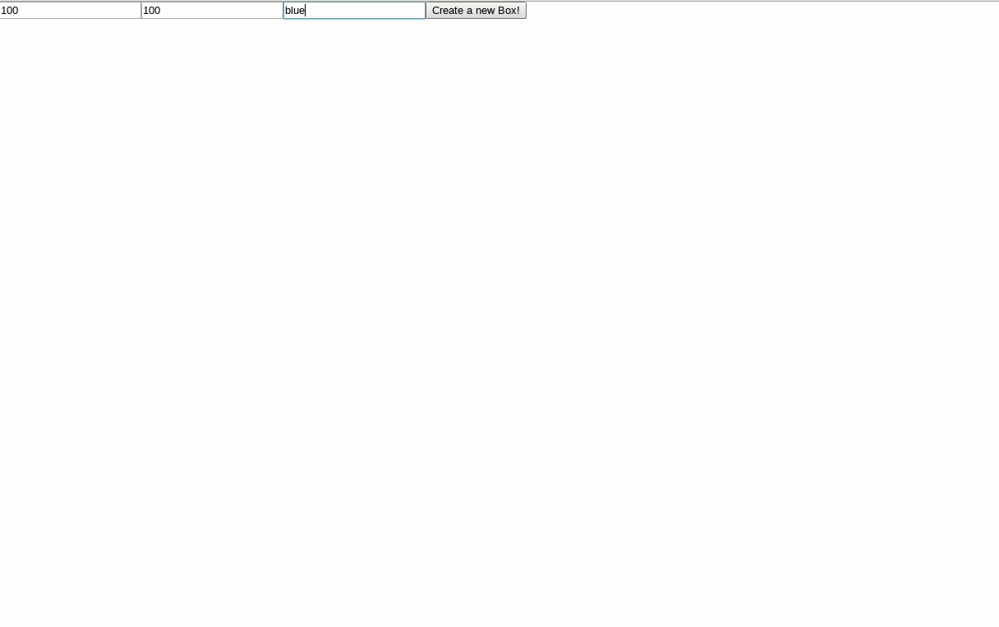
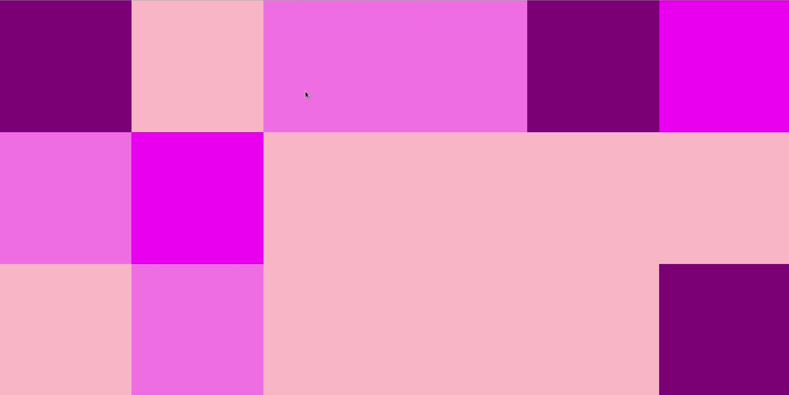
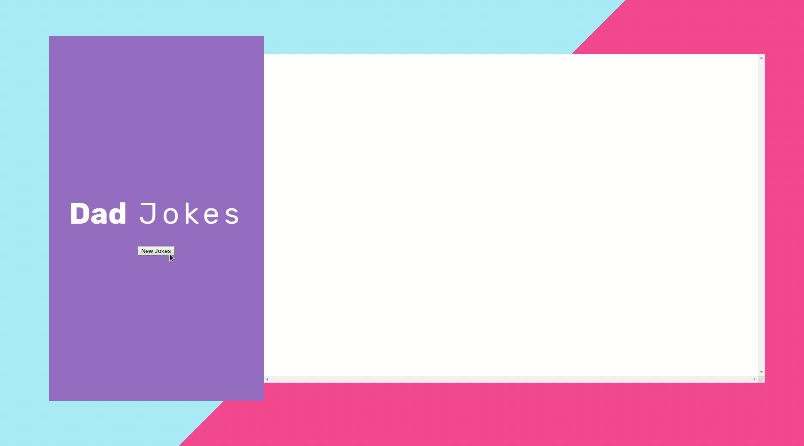
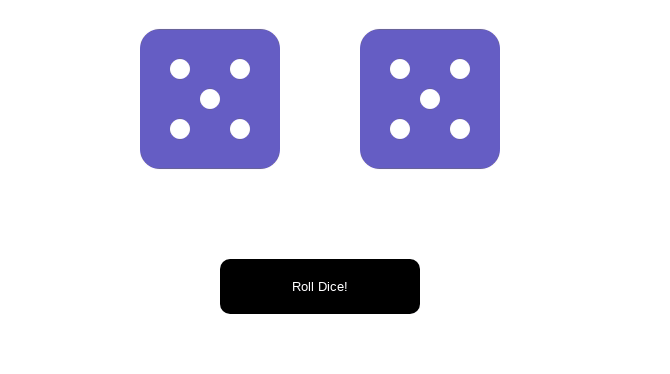
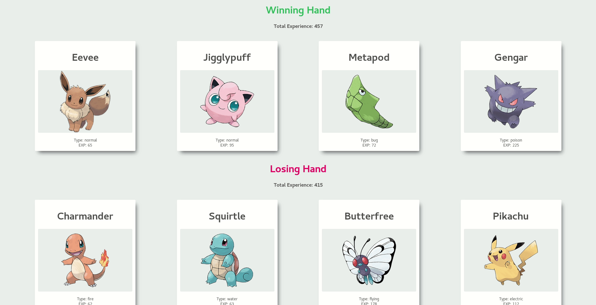
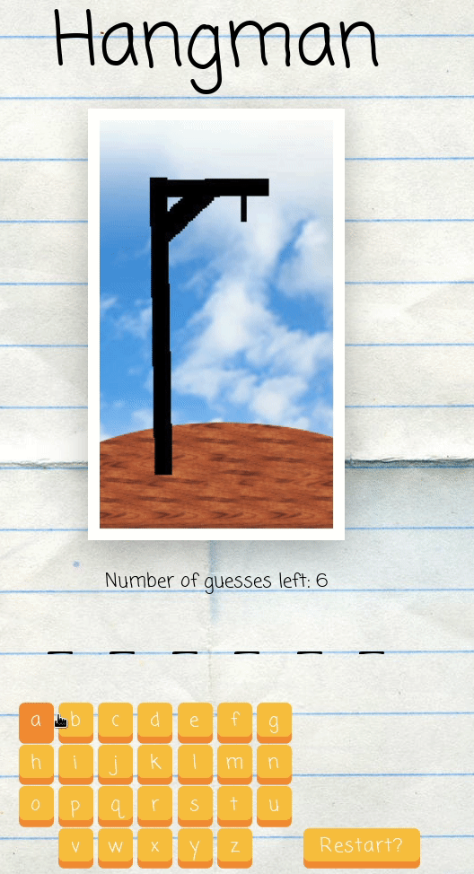
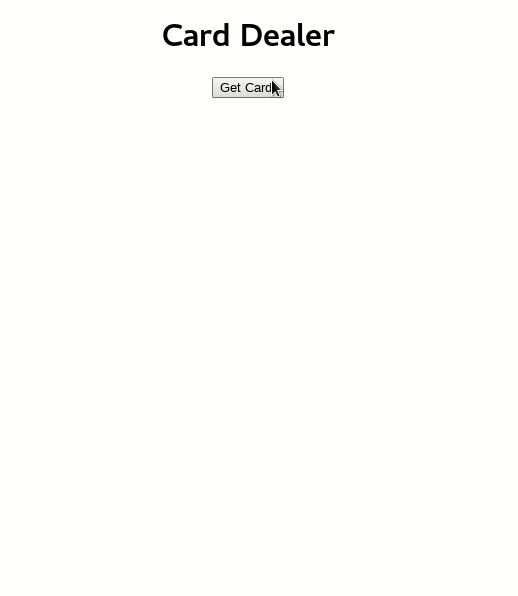

# What is this project?

This repository contains some small projects and exercises done on the Modern React Bootcamp by Colt Steele.

## What i've learned?
- A lot of ways to write logic on JSX
- Props and state management    
- Default props
- React behind the scenes: the working of bind, constructor and super.
- Many ways to bind
- Best pratices using arrow functions.
- Lifecycle methods: ComponentDidMount, ComponentWillUnmount, ComponentDidUpdate and some others.
- Load data via ajax, axios and async functions.
- Cool Javascript functions like: some, repeat, from, flat.
- The proper way of destructuring.
- Passing down functions to children components.
- Update state when form input changes.
- High order components
- Material UI
- JSS and WithStyles
- React Hooks, useState, useEffect and how to make reusable components.
- React context API, provider and reducer
- NextJS
- How to setup a custom webpack.

- A lot of some other stuffs that i need to update here.

## Some Liberaries used
### React router dom
- Route Props, Browse Router, Link, Switch exact path, relative paths.
- When to use render, and when to use component in a route.
### Rc-Slider
- Library to create some cool sliders
### Chroma JS
- Awesome library to manipulate everything on a color.
### React Transition Group
- Awesome library to create CSS transitions on react.

I will update this readme soon. It was a lot of things done!

# Projects done
## Color Palette Generator
This course had a lot of projects and things to build. The biggest, a full color palette maker, is uploaded to [this](https://github.com/vinioo/colorproject) repository, and you can access it [here](https://vinioo.github.io/colorproject)

## Coin Flipper
- Not an exciting exercise, but good to know and understand state and props management.

## Color Box Maker
- Simple, but again, a nice exercise to start creating dynamic stuff on React.

## Color Boxes
- A cool exercise. I really enjoy it.

## Dad Jokes
- A more complex exercise, it receives jokes from an API and has a vote system.

## Dice
- A simple game to roll the dice!

## Pokedex Generator
- It randomly generates two hands and exp from each pokemon and say who hand wins.

## Hangman
- A classic hangman hame! 

## Card Dealer
- A card dealer thingy to learn lifecycle methods.

## Lights Out Game
- A cool lights out game.

## Final thoughts
It was an incredible and fun experience. I learned the most essentials concepts of react by a great teacher and i really enjoyed all the ReactJS architecture.

## Special thanks
A special thanks to [@colt](https://github.com/Colt) for sharing this awesome content and knowledge.
