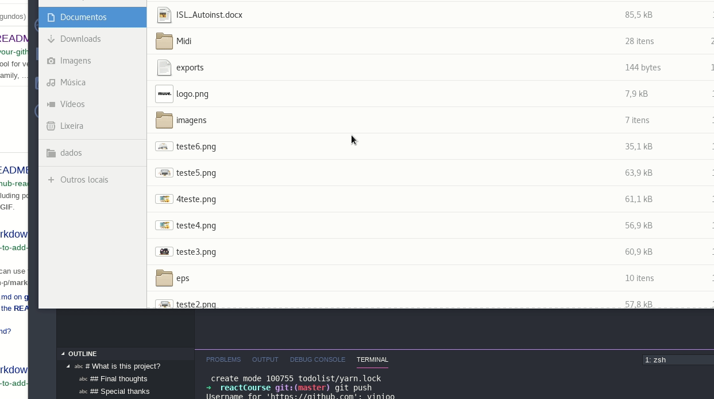

# What is this project?

This repository contains some small projects and exercises done on the Modern React Bootcamp by Colt Steele.

## What i've learned?
- A lot of ways to write logic on JSX
- Props and state management    
- Default props
- React behind the scenes: the working of bind, constructor and super.
- Many ways to bind
- Best pratices using arrow functions.
- Lifecycle methods: ComponentDidMount, ComponentWillUnmount, ComponentDidUpdate and some others.
- Load data via ajax and via async functions.
- Cool Javascript functions like: some, repeat, from, flat
- The proper way of destructuring.
- Passing down functions to children components.
- Update state when form input changes.
- High order components
- Material UI

- A lot of some other stuffs that i need to update here.

* ## Some Liberaries used
- #React router dom
- Route Props, Browse Router, Link, Switch exact path, relative paths.
- When to use render, and when to use component in a route.
- # Rc-Slider
- Library to create some cool sliders
- # Chroma JS
- Awesome library to manipulate everything on a color.

I will update this readme soon. It was a lot of things done!

## Projects done
This course had a lot of projects and things to build. The biggest, a full color palette maker, is uploaded to [this](https://github.com/vinioo/colorproject) repository.
<!--  -->

## Final thoughts

It was an incredible and fun experience. I learned the most essentials concepts of react by a great teacher and i really enjoyed all the ReactJS architecture.

## Special thanks
A special thanks to [@colt](https://github.com/Colt) for sharing this awesome content and knowledge.
